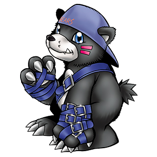
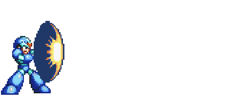

  <h2> ʕ｡•ﻌ•｡ʔ About  </h2>

  <table border="0" cellpadding="20" cellspacing="0" width="100%">
    <tr>
      <td align="center" width="50%">
        
<strong>Kuma64</strong> 

        
          
        
<strong>Job:</strong>

        
Data Analyst

        
<strong>Summary:</strong>

        <!-- 🔗 Social Links -->
        
      </td>
      <td align="left" width="60%">
        <h2 align="center">Interest and Goals 💡 </h2>
        
🐻 I enjoy working on Python scripts and full-stack development 

        
💪 Currently working on improving my data engineering skillset 

        
🔍 On the hunt for repos to help out in 

    </tr>
  </table>

  <h2>💻 Tech Stack</h2>

  <table>
    <tr>
      <td align="center" width="24%">
          
      </td>
      <td align="center" width="33%" style="padding-bottom: 100px;" >
        <h3>📝 Languages</h3>
          
        <h3>🛠️ Tools</h3>
          
          
      </td>
      <td align="center" width="%33">
        <h3>🌐 Frontend</h3>
          
        <h3>⚙️ Backend</h3>
          
          
    </tr>
  </table>

  <h2>🏋️‍♂️ Git Hub Stats</h2>

<table>
  <tr>
    <td align="left" width="30%">
         
    </td>
    <td align="center" width="45%">
      <a href="https://github.com/Kumasega64">
        
    </td>
    <td align="center" width="25%">
       <a href="https://github.com/Kumasega64">
      
        
      
    </td>
  </tr>
</table>

  

  

  <h2> 🔜 Current Projects</h2>

  <table border="0" cellpadding="20" cellspacing="0" width="100%">
    <tr>
      <td align="center" width="50%">
        📘 <a href="https://github.com/Kumasega64/studyDen" target="_blank">Study Buddy</a> 
        📱 <a href="https://github.com/KristianCorrea/study-buddy-mobile" target="_blank">Study Buddy Mobile</a> 
        🌐 <a href="https://github.com/Kumasega64/KumasPersonalWebsite" target="_blank">Personal Website</a>
    </td>
      <td align="center" width="30%">
          
    </td>
  </table>

  <h2> 🏆 Accomplishments</h2>

  <table>
    <tr>
      <td>
        📰 <a href="https://devpost.com/software/tldr-aef8ug?_gl=1*2jkpri*_gcl_au*MTc1ODM1ODg5NS4xNzU4MDQwODc3*_ga*NTgxODUyODk0LjE3NTgwNDA4Nzc.*_ga_0YHJK3Y10M*czE3NTg2Mzk5MzQkbzMkZzEkdDE3NTg2NDAzNzUkajYwJGwwJGgw" target="_blank"><strong>1nd Place 305 hacks 2025</strong> - TLDR</a> 
        
         🍰 <a href="https://github.com/Kumasega64/SweetSweetRecipes" target="_blank"><strong>MDC Apple Showcase winner winter 2024</strong> - Sweet Sweet Recipes</a> 
        
        💰 <a href="https://devpost.com/software/financio-xg15bp" target="_blank"><strong>2nd Place Shellhacks 2024</strong> - Financio</a> 
      </td>
    </tr>
  </table>

      
      

